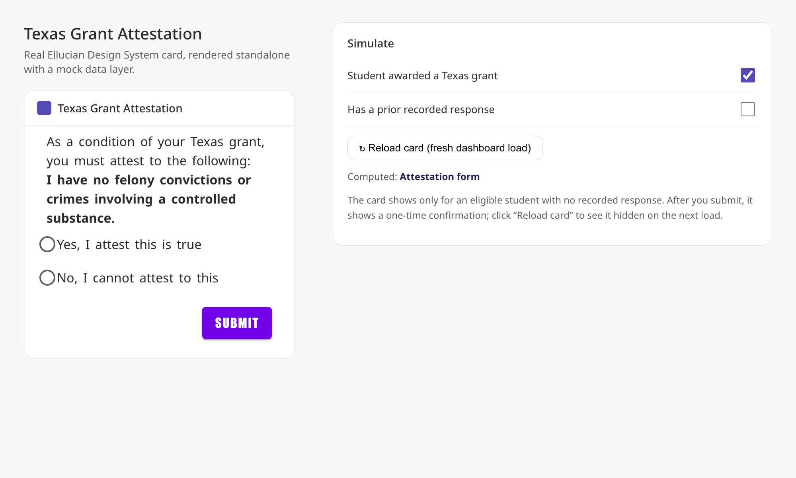

# Texas Grant Attestation

An Ellucian Experience extension (card) plus Data Connect serverless APIs that let a
student awarded a **Texas grant** attest to the statement:

> **"I have no felony convictions or crimes involving a controlled substance."**

The response is recorded on the Banner Financial Aid **RRAAREQ** form (table `RRRAREQ`)
as a tracking requirement, written through the `applicant_requirements` Banner Business
API via Data Connect.

It is modeled on the
[`experience-ethos-examples/emergency-contacts`](../experience/experience-ethos-examples/emergency-contacts)
example: a card that reads via Ethos and writes to Banner through Data Connect pipelines.

## Screenshots (standalone React + EDS)

The real Ellucian Design System card, rendered by the standalone harness
(`extension/standalone`) with a mock data layer - no tenant, no Ethos, no Data Connect.
Build with `cd extension && npm run build-standalone`, then open `extension/standalone/index.html`.

| Attestation form | After submit (confirmation) |
| --- | --- |
|  |  |

The full harness, with controls to toggle eligibility / prior response and reload the card:

> Deep links for each state (also used to capture the images above):
> `?bare=1` (card only), `?eligible=false` (hidden), `?recorded=yes|no` (prior response),
> `?auto=submit-yes|submit-no` (auto-submit to the confirmation).

## Contents

- [`extension/`](extension) - the Experience card (React) - see its [README](extension/README.md).
- [`dataconnect/`](dataconnect) - the GET and POST pipeline definitions - see its [README](dataconnect/README.md).
- [`docs/ethos-guide.md`](docs/ethos-guide.md) - the Ethos / Banner resources and setup.
- [`standalone-demo/index.html`](standalone-demo/index.html) - a self-contained, offline demo. Open it in any browser (double-click) to see the card's states and behavior with no tenant, no Ethos, and no Data Connect. For learning the flow only - not the real Ellucian Design System components.

## Running with no Banner / no tenant (learning mode)

This project is set up to be explored entirely offline:

- Quickest look (no build): open [`standalone-demo/index.html`](standalone-demo/index.html) - dependency-free HTML demo of the states (not real EDS).
- The real EDS card, no tenant: `cd extension && npm run build-standalone`, then open `extension/standalone/index.html` - bundles React + the Ellucian Design System and renders the actual card with mock data and controls.
- The real card in the SDK dev server: set `USE_MOCK_DATA=true` in `extension/.env` and run `npm start` (mocks the data layer; needs an Experience tenant pointed at it to render). See [extension/README.md](extension/README.md).
- The `dataconnect/` JSON and `docs/ethos-guide.md` document the real Ethos + Data Connect + Banner flow for reference.

## When the card is shown

The card appears only for an eligible student who has not yet submitted:

| Situation | Card |
| --- | --- |
| Not awarded a Texas grant | Hidden (renders nothing) |
| Eligible, no response yet | Shows the attestation form |
| Just submitted (this session) | Read-only confirmation, no form |
| Already submitted (any later load) | Hidden - prevents erroneous re-submission |

The recorded response is treated as final; the card does not offer an edit/re-submit path.

## How it works

1. **Eligibility** - on load, the GET pipeline resolves the student's Banner ID and checks
   `award-maintenance` (RPRAWRD) for an award with one of the configured Texas-grant fund
   codes in the configured aid year. Only eligible students see the form.
2. **Form** - the card shows the attestation statement with Yes/No and a Submit button.
   Any previously recorded answer is pre-filled and its status/date shown.
3. **Record** - on submit, the POST pipeline re-validates eligibility, maps the answer to
   the configured RRRAREQ status code, stamps the status date, and writes the row to
   RRAAREQ via the `applicant_requirements` Business API.

## Setup

See [`dataconnect/README.md`](dataconnect/README.md) to create the pipelines, then
[`extension/README.md`](extension/README.md) to build and deploy the card. All
institution-specific values (aid year, fund codes, requirement/status codes) are
**card configuration**, not code.

## Status / things to confirm in your tenant

- The Business API resource names (`award-maintenance`, `applicant-requirements`) and the
  `acceptVersions` / `contentVersion` values (`1.0.0`) in the pipelines must match how
  those APIs are published as Ethos resources in your environment.
- The `treqCode` / `trstCode` values must exist on RTVTREQ / RTVTRST in Banner Financial Aid.
- The card has not been run against a live tenant here; `npm install` + `npm run lint` and
  a Data Connect dry run are the recommended first validations.

 

Copyright 2025 Ellucian Company L.P. and its affiliates.
