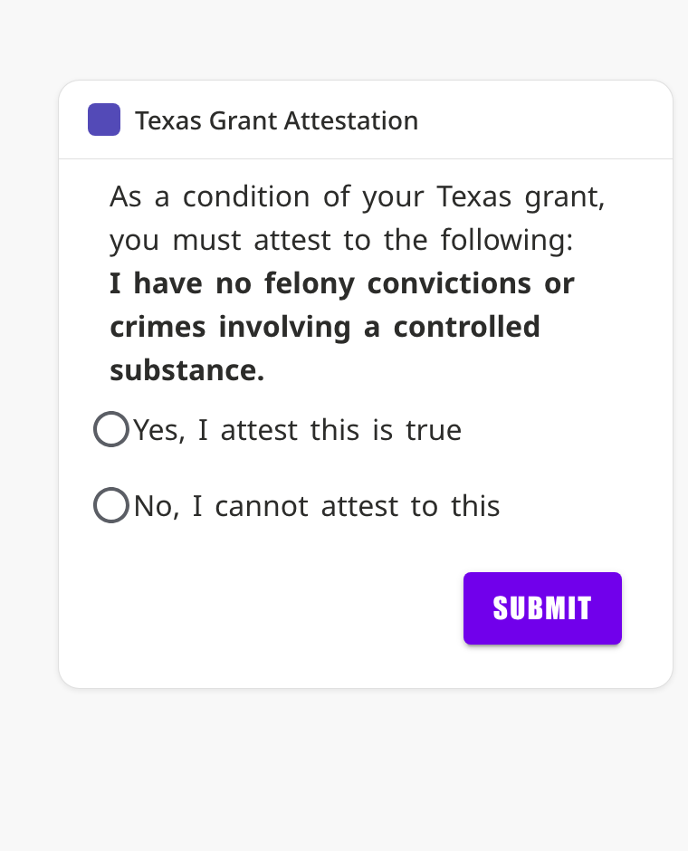
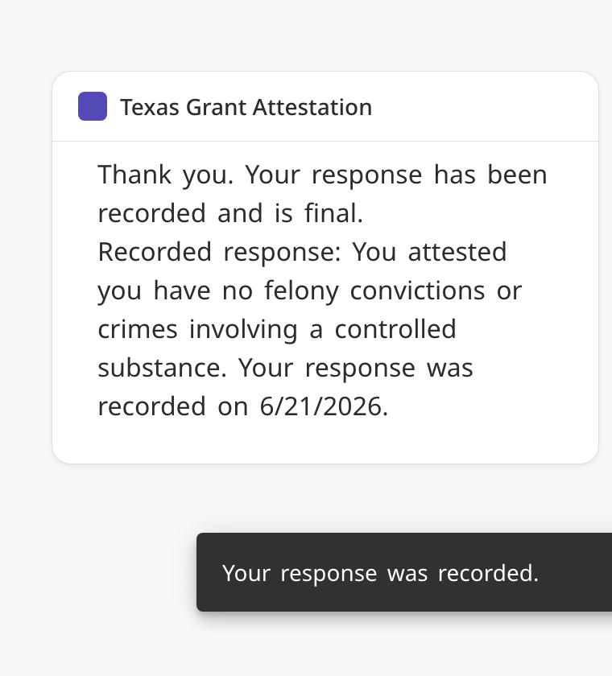

# Texas Grant Attestation - Extension

An Ellucian Experience card that presents a one-question attestation form to students
who have been **awarded a Texas grant**, and records the response on Banner **RRAAREQ**
(financial-aid tracking requirements) via the `applicant_requirements` Business API
through Data Connect.

The card:

- Resolves the signed-in student and checks eligibility (a Texas-grant award for the
  configured aid year). Non-eligible students see an informational message instead of the form.
- Shows the statement **"I have no felony convictions or crimes involving a controlled
  substance."** with Yes/No options and a Submit button.
- On submit, writes the answer to RRAAREQ (requirement code + status code + status date,
  keyed by Banner ID and aid year).
- If a response already exists, it is pre-selected and the recorded status/date is shown;
  the button becomes **Update Response**.

This follows the structure of the `experience-ethos-examples/emergency-contacts` example.

## Quick Start

1. Install Node 22 (`nvm use`), then `npm install` in this `extension/` directory.
2. Create the two Data Connect pipelines from `../dataconnect` (see that folder's README).
3. Copy `sample.env` to `.env` and set:
   - `EXPERIENCE_EXTENSION_UPLOAD_TOKEN` - your Experience upload token.
   - `PIPELINE_GET_TEXAS_GRANT_ATTESTATION` / `PIPELINE_POST_TEXAS_GRANT_ATTESTATION` -
     the published pipeline names (or your prefixed names).
4. Build / deploy:
   - `npm run build-dev` - local build.
   - `npm run deploy-dev` - build and upload to Experience.
   - `npm start` - local dev server with live reload.

## Local offline mock (no Data Connect / no Ethos)

You don't need Data Connect to build and iterate on the card. Set `USE_MOCK_DATA=true`
in `.env` and the card uses an in-memory data layer (`src/data/mock.js`) instead of the
SDK data hooks - no pipelines, no Ethos key, no tenant data required.

```
USE_MOCK_DATA=true
MOCK_ELIGIBLE=true            # set false to preview the ineligible (hidden) state
MOCK_CURRENT_ANSWER=          # blank, or "yes" / "no" to seed a recorded response
MOCK_AID_YEAR=2526
```

Then `npm start` (serves the compiled card on http://localhost:8082). The card is
selected at build time: `USE_MOCK_DATA=true` -> mock container, otherwise the live
Data Connect container. The Data Connect path is untouched and still works for real
deployments.

Note: in the normal SDK build, React and the Ellucian Design System are *externals*
provided by the Experience host, so opening http://localhost:8082 directly won't render
the card on its own - point an Experience tenant (dev mode) at the local dev server to see it.

### Render the real card standalone (no tenant)

For a no-tenant visual of the *actual* EDS card, there is a standalone harness that
bundles React + the Ellucian Design System (instead of treating them as host externals)
and renders `AttestationView` with an in-page mock and simple controls:

```
npm run build-standalone     # writes standalone/bundle.js
# then open extension/standalone/index.html in a browser
```

It has toggles for eligibility / prior response and a "Reload card" button, so you can
watch the form -> submit -> confirmation -> hidden-on-next-load behavior with the real
components. See `webpack.standalone.js` and `standalone/index.jsx`.

| Attestation form | After submit |
| --- | --- |
|  |  |

Deep-link params (also used for the screenshots): `?bare=1`, `?eligible=false`,
`?recorded=yes|no`, `?auto=submit-yes|submit-no`.

There is also a lighter, dependency-free demo at `../standalone-demo/index.html` (plain
HTML/JS, not real EDS) that just illustrates the states and flow.

## Card configuration (Experience Setup, Step 2)

Set these server configuration values; they are passed through to the Data Connect
pipeline parameters, so no Banner-specific codes are hardcoded:

| Field | Maps to | Example |
| --- | --- | --- |
| Ethos API Key | `ethosApiKey` | *(secret)* |
| Aid Year | `keyblckAidyCode` | `2526` |
| Texas Grant Fund Code(s) | `RPRAWRD.fundCode` | `TXEG,TPEG` |
| Attestation Requirement Code | `RRRAREQ.treqCode` | *(your RTVTREQ code)* |
| Status code when YES | `RRRAREQ.trstCode` | *(your RTVTRST code)* |
| Status code when NO | `RRRAREQ.trstCode` | *(your RTVTRST code)* |

## Layout

```
extension/
  extension.js                     card definition + server configuration fields
  src/
    cards/TexasGrantAttestation.jsx  the card UI (eligibility gate + form)
    data/attestation.js              POST helper that records the response
    hooks/dashboard.js               api-stat + refresh wiring
    i18n/                            en.json + intl plumbing
    util/                            events + log-level helpers
```
